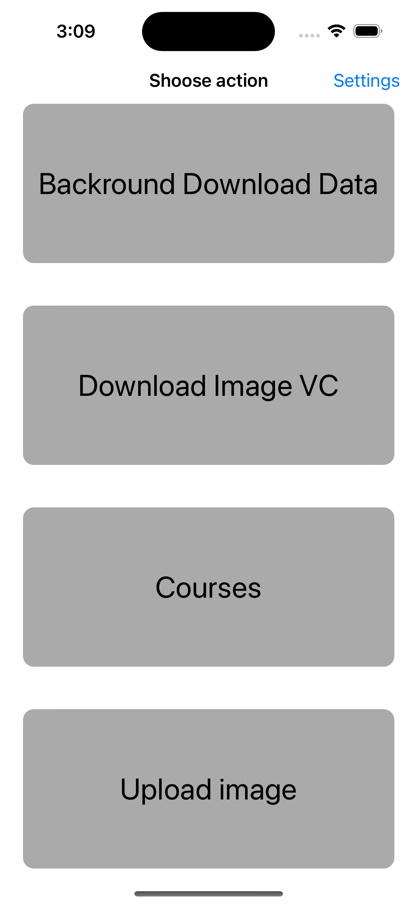
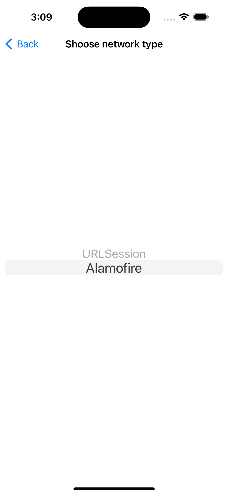

# Network App
### Short Description:

A small project that displays the work with the sesta. Uploading, unloading pictures from the server using api.
Parsing information from the server into JSON, and displaying it accordingly. Sending POST and GET requests to the server.

---

### Stack of technologies:
UIKit, MVVM, URLSession, Alamofire, GCD, UserDefaults, Notifications, Storyboard. 

---

### Basic information about the project: 
- The project is written entirely in UIKit.
- Used MVVM architecture pattern. 
- Use URLSessin and Alamofire as network requests. 
- Demonstrated work with multi-threaded GCD
- Working with Notifications (notification of the end of loading in the background)
- Imported CocoaPods manager into the project.
- A small number of simple Unit tests are written.
- Demonstrated work with the Storyboard.
- Navigation Controller is used in the project.
- TableView and CollectionVide are used in the project. 
- Saves the selected networking option (URLSession/Alamofire) to the local UserDefaults repository.

---

### Screenshots and gif

---

